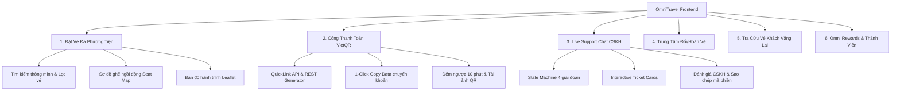

# 🚀 OmniTravel - Nền Tảng Đặt Vé Du Lịch Đa Phương Tiện & Trợ Lý Thông Minh

<p align="center">
  
</p>

<p align="center">
  <strong>Giải pháp đặt vé toàn diện: Máy bay ✈️ • Tàu hỏa 🚆 • Xe khách liên tỉnh 🚌</strong><br />
  Tích hợp thanh toán <strong>VietQR Chuẩn Quốc Gia (NAPAS 247)</strong>, Trợ lý <strong>Live Chat CSKH 4 giai đoạn</strong>, và Trung tâm <strong>Tra cứu & Hoàn vé tự động</strong>.
</p>

<p align="center">
  
  
  
  
  
  
</p>

---

## 🌟 Tổng Quan Dự Án

**OmniTravel** là ứng dụng web Frontend hiện đại phục vụ nhu cầu đặt vé du lịch và di chuyển liên tỉnh tại Việt Nam. Được thiết kế với mục tiêu tối ưu trải nghiệm người dùng (UX) và hiệu năng hiển thị cao nhất, OmniTravel kết nối các dịch vụ giao thông hàng đầu:

- **Hàng không:** *Vietnam Airlines, Vietjet Air, Bamboo Airways, Vietravel Airlines*.
- **Đường sắt:** *Tổng công ty Đường sắt Việt Nam (DSVN)*.
- **Đường bộ:** *Phương Trang (FUTA Bus Lines), Mai Linh Express, Kumho Samco, Thành Bưởi, Hoàng Long*.

---

## 💎 Tính Năng Nổi Bật



### 1. 💳 Module Thanh Toán VietQR Chuẩn Quốc Gia (NAPAS 247)
- **Tạo mã QR tức thì:** Hỗ trợ cả 2 phương thức QuickLink Image Generator và VietQR REST API v2 với khả năng tự động fallback linh hoạt.
- **1-Click Copy Data:** Tự động sao chép Số tài khoản, Ngân hàng thụ hưởng, Số tiền, Tên chủ sở hữu và Nội dung chuyển khoản kèm visual tooltip phản hồi tức thì.
- **Bộ đếm thời gian thực:** Đồng hồ đếm ngược 10:00 phút, tự động chuyển sang chế độ khẩn cấp (cảnh báo đỏ nhịp thở) khi còn dưới 2 phút.
- **Tải ảnh mã QR:** Tải file ảnh trực tiếp về thiết bị chỉ với 1 cú nhấp chuột để quét trong app ngân hàng.

### 2. 💬 Live Support Chat 4 Giai Đoạn (Finite State Machine)
- **Workflow CSKH chuyên nghiệp:** Điều phối 4 giai đoạn tuần tự (`TOPIC_SELECTION` ➡️ `CONNECTING` ➡️ `CONNECTED` ➡️ `RESOLVED`).
- **Interactive Ticket Widget:** Đính kèm trực tiếp thông tin vé vào nội dung chat để CSKH xử lý ngay lập tức.
- **Trải nghiệm vuốt chạm linh hoạt:** Danh sách chủ đề nhanh (Quick Topic Chips) hỗ trợ kéo chuột (mouse drag-to-scroll) mượt mà không xung đột giao diện.
- **Chấm Online trạng thái thực:** Hiệu ứng Pulse (sóng lan tỏa nhịp thở) biểu thị tư vấn viên đang trực tuyến 24/7.

### 3. 🎫 Tra Cứu Vé Cho Khách Vãng Lai (Guest Booking Lookup)
- Tra cứu nhanh vé điện tử thông qua **Mã đặt vé (PNR Code)** và **Số điện thoại / Email** mà không bắt buộc phải đăng nhập.
- Hiển thị vé điện tử (E-Ticket) với mã vạch Barcode và QR code kiểm tra an ninh tại ga/sân bay.

### 4. 🔄 Trung Tâm Hoàn / Đổi Vé Nhanh (Fast Refund Center)
- Tự động tính toán số tiền hoàn dựa trên thời gian khởi hành thực tế và chính sách riêng biệt của từng phương tiện (`refundCalculation.service.ts`).
- Quy trình hoàn vé đa bước minh bạch, hỗ trợ nhận tiền qua tài khoản ngân hàng liên kết.

### 5. 🗺️ Bản Đồ Hành Trình Trực Quan & Khẳng Định Chủ Quyền
- Bản đồ tương tác Leaflet hiển thị tuyến đường di chuyển trực quan.
- Tích hợp chuẩn nhận diện chủ quyền biển đảo Việt Nam: **Quần đảo Hoàng Sa** và **Quần đảo Trường Sa**.

---

## 🛠️ Ngăn Xếp Công Nghệ (Tech Stack)

| Hạng mục | Công nghệ sử dụng |
| :--- | :--- |
| **Core Framework** | [React](https://react.dev/) + [TypeScript](https://www.typescriptlang.org/) |
| **Build Tool & Bundler** | [Vite](https://vitejs.dev/) |
| **UI Library** | [Ant Design v5](https://ant.design/) (ConfigProvider & Token Customization) |
| **Styling Architecture** | **SCSS Strict BEM** (`.block__element--modifier`) |
| **Design Tokens** | CSS Variables (`_tokens.scss`) + Hệ màu chuyên nghiệp |
| **Typography** | Font chuẩn tiếng Việt: **"Be Vietnam Pro"** |
| **Icons** | 100% Vector Icons từ [lucide-react](https://lucide.dev/) |
| **Bản đồ** | [Leaflet](https://leafletjs.com/) / [React-Leaflet](https://react-leaflet.js.org/) |

---

## 🏛️ Kiến Trúc Mã Nguồn (Clean Architecture & SOLID)

```
travel-booking/
├── public/                      # Static assets & logos
├── src/
│   ├── components/              # Reusable UI components
│   │   ├── common/              # SmoothTabs, AnimatedCounter, FillConfirmButton...
│   │   ├── layout/              # AppHeader, AppFooter, AppLayout
│   │   ├── map/                 # RouteMap, SovereigntyMarkers, MapVectorMarker
│   │   ├── policy/              # PolicyModal
│   │   ├── search/              # SearchWidget, LocationSelect
│   │   └── tickets/             # TicketCard, TicketList, TicketDetailDrawer...
│   ├── features/                # Feature-driven Modules
│   │   ├── auth/                # Đăng nhập / Đăng ký / OAuth Modal
│   │   ├── booking/             # Quy trình đặt chỗ & Vé điện tử
│   │   │   ├── components/      # PaymentModal (VietQR), GuestLookupModal...
│   │   │   └── hooks/           # useVietQRPayment, useGuestBookingStorage
│   │   ├── chat/                # Live Support Chat CSKH 24/7
│   │   │   ├── components/      # SupportChatWidget, TopicSelector, ChatTicketCard...
│   │   │   └── hooks/           # useSupportChatSession, useLiveChat, useChatScroll
│   │   ├── support/             # Trung tâm hỗ trợ & Hoàn đổi vé
│   │   │   ├── components/      # FastRefundModal, SupportFloatingWidget...
│   │   │   └── hooks/           # useTicketRefund
│   │   └── user/                # Quản lý tài khoản, lịch sử vé & Omni Rewards
│   ├── services/                # Business Logic & External API Integrations
│   │   ├── vietqr.service.ts    # VietQR Generator & Bank Directory (SOLID IPaymentGatewayService)
│   │   ├── refundCalculation.service.ts # Công cụ tính biểu phí hoàn hủy vé
│   │   ├── guestLookup.service.ts       # Service tra cứu vé vãng lai
│   │   ├── chat.service.ts      # CSKH Bot engine & auto responder
│   │   └── carrier/             # Registry thông tin các hãng vận tải
│   ├── styles/                  # SCSS Design Tokens & BEM Mixins
│   │   ├── _tokens.scss         # Central design tokens (Colors, Spacing, Radius)
│   │   ├── _bem-mixins.scss     # SCSS BEM helper mixins
│   │   └── main.scss            # Global styles
│   ├── types/                   # Central TypeScript Type Definitions
│   ├── App.tsx                  # Root Application Component
│   └── main.tsx                 # Entry Point
├── package.json
└── vite.config.ts
```

---

## ⚡ Hướng Dẫn Cài Đặt & Chạy Cục Bộ

### Yêu cầu tiên quyết
- **Node.js**: Phiên bản `>= 18.0.0`
- **npm** hoặc **yarn** / **pnpm**

### Các bước khởi chạy

1. **Clone repository về máy:**
   ```bash
   git clone https://github.com/doanlong266/travel-booking.git
   cd travel-booking
   ```

2. **Cài đặt các gói phụ thuộc (Dependencies):**
   ```bash
   npm install
   ```

3. **Khởi chạy môi trường phát triển (Development Server):**
   ```bash
   npm run dev
   ```
   > Ứng dụng sẽ chạy tại địa chỉ: `http://localhost:5173`

4. **Kiểm tra TypeScript & Đóng gói Production:**
   ```bash
   npm run build
   ```

---

## 🎨 Quy Chuẩn Thiết Kế & Giao Diện (Design System)

- **Nguyên tắc thẩm mỹ:** Thiết kế theo chuẩn giao diện du lịch cao cấp, ứng dụng hiệu ứng đổ bóng mờ, viền bo tròn mềm mại (`border-radius: 12px - 20px`), và các chuyển động micro-interaction mượt mà.
- **Biến CSS Tokens:** 100% thuộc tính màu sắc, khoảng cách, font chữ được quản lý tập trung tại `_tokens.scss`:
  - Primary Brand: `#0066cc` / Gradient `#0052a3`
  - Success / Online Status: `#10b981` (Emerald Green)
  - Danger / Urgent Warning: `#ef4444` (Coral Red)
  - Canvas Background: `#f8fafc` / `#ffffff`
- **Icon chuẩn hóa:** Toàn bộ icon trong hệ thống sử dụng vector từ `lucide-react`, tuyệt đối không dùng emoji hệ điều hành để đảm bảo tính đồng nhất trên mọi nền tảng (Windows, macOS, iOS, Android).

---

## 📄 Bản Quyền & Giấy Phép

Dự án được xây dựng và phát triển bởi **[doanlong266](https://github.com/doanlong266)**. Mọi quyền được bảo lưu.
